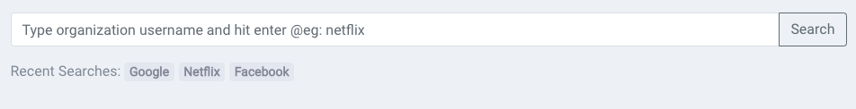
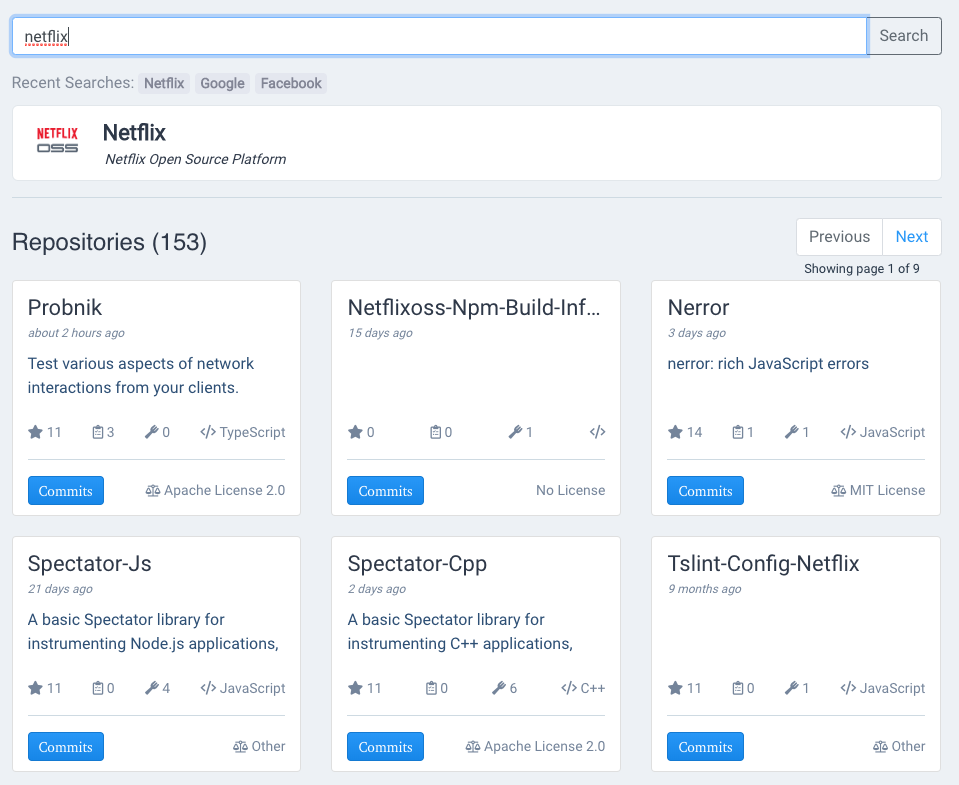
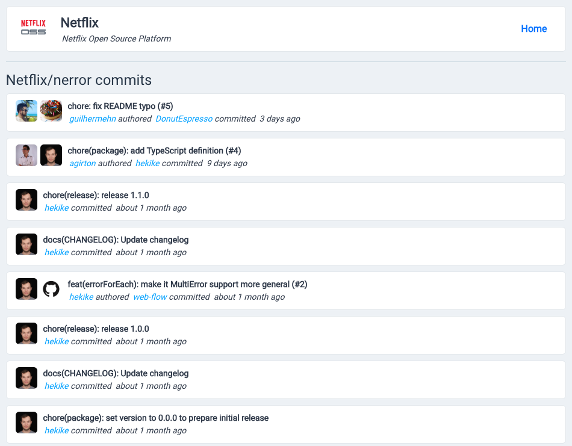

# Netflix 

Please go through this readme file for the explanation on the how to setup locally, run the automated tests, manual tests, the technology stack I have used and screenshots of the application.

`Important note: as the requirement says to fetch the repositories basing on the popularity, I couldn't find the api end point that takes the metric to sort its results.`

## For online demo: [Click Here](https://netflix.vijaykumar.me)
## For setting up locally
clone the repo and then install dependencies using the following command.
```
npm install
```
Start the server using the following command
### Local setup
```
npm run serve
```

### Run unit tests
```
npm run test:unit
```
### Automated tests 
 - renders the correct markup
 - has a button to search
 - Input can be typed
 - dispatches "searchOrganization" when input search button is clicked

### Manual tests
 - Click on search or hit enter withtout typing anything in the input, this shouldn't send any request to the server
 - Type `netflix` and click on search button or hit enter to get the results of the organization and its list of repositories
 - Once the repositories are listed, pagination should also be shown, previous button should be disabled by default and next button should be available for cilck. Clicking on next should show next page results and also show the loading icon while making an axios call. Once the next page is shown, loading icon should be hidden and also previous button shoudl be enabled.
 - The repo card should show some of the details of the repo like name, last pushed, stars, forks, lanague, license and with a button to browse commits.
 - Click on commits should show the recent commits of hte page.

# Explanation

Currently this application has the following features

  - Search for an organization
  - Quickly click on the recent searched organization
  - Navigate through all the pages
  - Browse through commits of each repo

## Technology Stack
I have used vuejs as frontend framework with vuex as stat management system. 
  - [Vuejs](https://vuejs.org/) (for single page application)
  - [Vuex](httpshttps://vuex.vuejs.org/) (for state management for vuejs similar to redux in reactjs)
  - [Vue Test Utils](https://vue-test-utils.vuejs.org/) (vuejs wrapper for testing using jest)
  - [Axios](https://github.com/axios/axios) (for making http calls)
  - [ESLint](https://eslint.org/) (for linting vue components)
  - HTML
  - CSS
  - [Twitter Bootstrap](https://netflix.vijaykumar.me) (for quick designed components and responsive)
  - [jQuery](https://netflix.vijaykumar.me) (as a dependency for the bootstrap)
  - Webpack (module bundler)
  - Visual Studio Code

## Screenshots of the application

#### Search

#### List of Repositories

#### List of Commits

